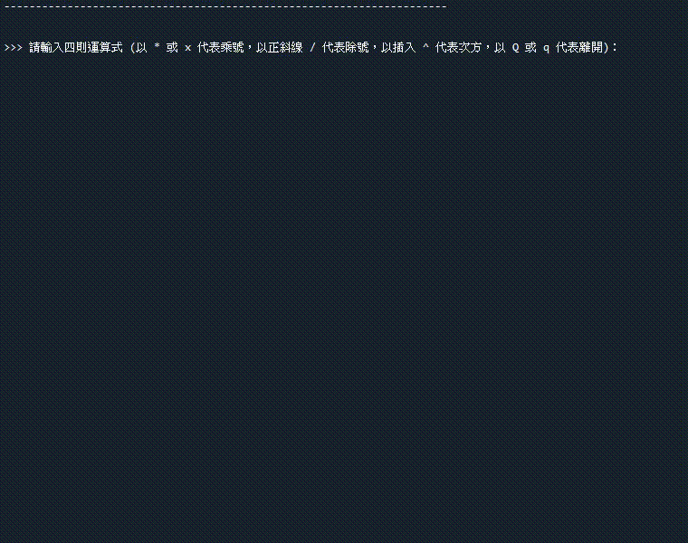

<h1 align="center">
  <br>
  [指定專題作品] 四則運算 (Python應用)
</h1>


## 目錄
* [摘要](#摘要)
* [重點程式碼說明](#重點說明)
* [系統環境](#系統環境)
* [聯絡資料](#聯絡資料)
* [致謝](#致謝)
* [權限](#權限)


## 摘要
### 1. 本作品具有 四則運算、次方 及 左右小括弧 之數學運算功能。
### 2. 輸入時，若檢測到多餘的空格會先刪除，再做數學運算。
### 3.



<strong><em>若您有興趣想更了解此程式，請參考下方的聯絡方式，進一步聯絡作者，謝謝參閱。</em></strong>


## 重點程式碼說明
### 依據數學運算的優先順序，設定 加減乘除、次方 及 左右小括弧 之函式來數學運算 。
  ```python
  # 搜尋得知下一個字元
  def peek():
    ⋮
  # 取走當前字元
  def get():
    ⋮
  # 當下一個字元為數字時，回傳數字 或 乘10再回傳結果
  def number():
    result = int(get()) - 0
    ⋮
    else:
      while '0' <= peek() <= '9':
        ⋮
    return result

  # 當下一個字元為 ()- 字元時，處理 ()- 符號       
  def factor():  
    if '0' <= peek() <= '9':
      return number()

    elif peek() == '(':
      ⋮
      return result

    elif peek() == '-':
      ⋮
      return -factor()

    return 0

  # 當下一個字元為 *xX^/ 字元時，處理 *xX^/ 符號
  def term():
    result = factor()

    while peek() != None and peek() in '*xX^/':
      current_char = get()

      if current_char in '*xX':
        ⋮
      elif current_char == '^':
        ⋮
      else:
        ⋮
    return result;

  # 當下一個字元為 +- 字元時，處理 +- 符號
  def expression():
    result = term()

    while peek() != None and peek() in '+-':
      if peek() == '+':
        ⋮
      else:
        ⋮
    return result;
  ```

### 主程式，將輸出內容皆寫入文件 (.txt)
  ```pytohn
  f = open('filename.txt', 'w', encoding = 'utf-8')

  while True:
    input_expression = input(請輸入四則運算式：)

    print(您輸入的四則運算式為：)
    f.write(請輸入四則運算式：)

    # 輸入 Q 或 q 字元，則退出程式
    if input_expression.lower() == 'q':
      print(退出程式)
      f.write(退出程式)
      break

    r = p = 0
    available_characters = '1234567890+-*/xX^() '

    for p in range(len(input_expression)):
      # 判別：如果輸入未允許的字元，則 r = 1
      if input_expression[p] not in available_characters:
        r = 1
        break

    # 判別：如果 r = 1，輸出錯誤訊息
    if r == 1:
      print(輸入錯誤，請重新輸入)
      f.write(輸入錯誤，請重新輸入)

    # 判別：如果輸入皆為允許字元，輸出運算結果
    else:
      #去除輸入字串中的空格
      spaces_removed_expression = re.sub(' ', '', input_expression)
      # 計算空格數量
      space_amout = len(input_expression) - len(spaces_removed_expression)

      copied_expression = spaces_removed_expression
      expression_to_parse = list(spaces_removed_expression)

      # 開始運算
      result = expression()

      print(您所輸入的空格數量：\n 調整後的四則運算式與計算結果為：)
      f.write(您所輸入的空格數量：\n 調整後的四則運算式與計算結果為：)

  f.close()

  ```
  
### 讀取並顯示檔案內容
  ```python
  f = open('filename.txt', 'r', encoding = 'utf-8')
  ⋮
  print(檔案內容皆讀取完畢，程式結束)
  ```
  

## 系統環境
### 作業系統
* OS：Windows 7 / 10 (Mac OS、Linux 系統亦可相容)

### 相關套件
* Python 核心：3.10


## 聯絡資料
👤 **Larry Jhuang**
  * Email: larry30500@gmail.com


## 致謝
*非常感謝指導老師 (Francesco Ke) 提供程式設計的靈感和方向，並細心指導學生編寫程式時，所需注重的細節。*

*如果您喜歡此專案，記得點擊⭐️支持作者。*


## 權限
目前設定為 MIT 權限。請參閱 `LICENSE`，了解更多相關 MIT 權限的規定。

<br><br>[返回目錄](#目錄)
